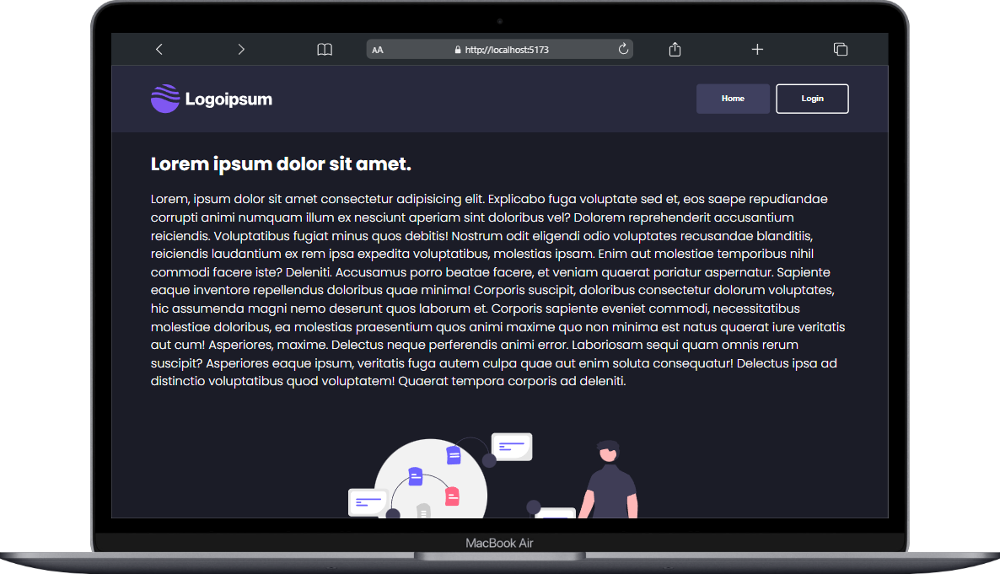
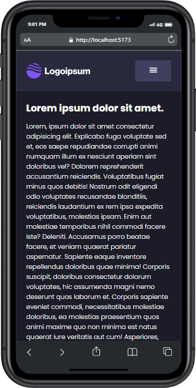

# React lorem

  

    
🖥️ Desktop

    
  

  

    
📱 Mobile

    
  

# EN

This is my first contact with react js, in this project I learned a lot of concepts about this incredible technology, and started my journey in this incredible universe of possibilities.

## Some of the concepts learned

-    Components.
-    JSX.
-    State.
-    Properties (props).
-    Events.
-    Conditional renderization.
-    Ps: Obviously there's more, but those are the principal.

## How to use

> -    <b>Clone this repo in your wished folder</b>

        Ex:
            git clone <this-repo-link>

> -    <b>Install all the dependencies</b>

        Ex:
            npm install

> -    <b>Initialize the project</b>

        Ex:
            npm run dev

> -    <b>Open the localhost on your browser and enjoy 😎</b>

# Pt-br

Este é o meu primeiro contato com react js, neste projeto pude aprender muitos conceitos sobre essa incrível tecnologia, e iniciar minha jornada nesse incrível universo de possibilidades.

## Alguns dos conceitos aprendidos

-    Componentes.
-    JSX.
-    Estado.
-    Propriedades (props).
-    Eventos.
-    Renderização condicional.
-    Obs: Obviamente existem outros, mas estes são os principais.

## Como usar

> -    <b>Clone este repositório na pasta desejada</b>

        Ex:
            git clone <this-repo-link>

> -    <b>Instale as dependências</b>

        Ex:
            npm install

> -    <b>Inicialize o repositório</b>

        Ex:
            npm run dev

> -    <b>Abra o localhost no seu navegador e aproveite 😎</b>
